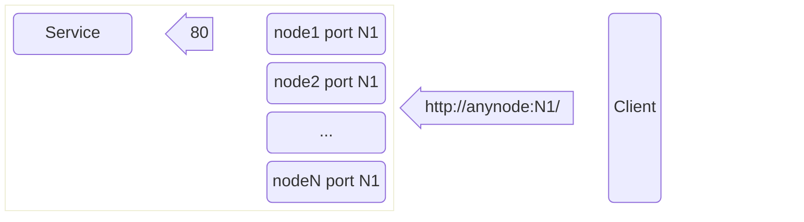
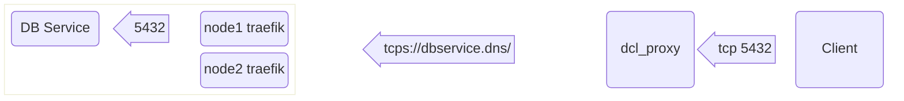

# DCL Ingress

The Docker Swarm networks, the internal overlay networks, are internal and not exposed to outside by default. Docker Swarm provides a default ingress mechanism, that allows ports to be exposed on the host network (on all the nodes). This is typically achieved by `-p` or `--port` flag in `docker service` or `docker run`.

The disadvantages of this default ingress method is that each service needs to have its own unique port and it is difficult to
manage these different port numbers. Even if we use dynamic allocation of exposed ports, it is cumbersome to access the services
by changing port numbers.

Since all of the services are HTTP and TCP based, DCL Ingress provides a default HTTPS and TCP/TLS based reverse proxy as the
default ingress mechanism and expose them as `named services`, that can be accessed by the clients using DNS names via HTTPS or
TCP/TLS.

While using DCL, services exposing ports via `--port` will be ignored. Instead, they need to specify `dcl.ingress.` labels that
will allow the ingress services to be setup automatically.

While this page refers to concepts, Please refer to [Ingress Getting Started](../getting-started/ingress.md), [Ingress Reference](../reference/ingress.md) and [Setup details](../setup/ingress.md) for more details.

## Overview

### Default Docker Swarm Ingress

The default Docker Swarm ingress (that is not supported in DCL) has a mechanism like this:



In the above, the port *N1* can be statically specified in the service specs via `--port N1:80` or dynamically
allocated by Docker via `--port 80`. All clients need to *know* the port number to access the same.

One typically adds a reverse proxy like `haproxy` in the front, but one needs to manually configure the haproxy for
each service, which is again cumbersome.

These days, reverse proxies like `traefik` or `caddy` supports docker natively and configures itself automatically,
which is what we will be doing in DCL, by default.

### DCL Ingress for HTTP/HTTPS

DCL Ingress will use `traefik` (and in the future `caddy`) as the default ingress proxy and will be situated within
the cluster.


The configuration for specifying the
* port number service is listening on
* service DNS name
* etc

are configured via `dcl.ingress.` labels in the service / container specs. The details are shared below.

### DCL Ingress for TCP/TLS

There is often a need for exposing database connections from outside, to within the cluster. While we can consider the
default Swarm mechanism of different port numbers for different services, DCL has decided to move away from that method.
Instead all TCP services can be exposed and accessed via TCP/TLS. With TCP/TLS, a single port number is sufficient to
be exposed, while the TLS handshake will provide the name of the service using TLS/SNI.

Since most clients may not have a TLS based clients, DCL provides a thin client side proxy `dcl_tcpproxy` that needs to be
run on the client side, which will provide the tunneling of regular TCP to TCP/TLS.



## Configuring HTTP Ingress

There are two different ways of configuring Ingress with DCL.

### Service Specs

The Ingress configuration for each service is done directly in the Service / Container spec as labels. This is much
easier and consolidates all configuration related to a service in a single place.

```yaml
services:
  web:
    image: nginx:latest
    labels:
      dcl.ingress.http.hostname: www.example.com
      dcl.ingress.http.port: 8080
```

In case, if the same external hostname (as in `www.example.com` as here) is used by multiple services, then you just
specify the same hostname in each of the services, but you would then specify other conditions like `paths` to differentiate
what type of requests should be sent to which service.

DCL uses `traefik` under the hoods, but will likely support `caddy` / `nginx` in the future. DCL supports the following

configuration options to route requests based on information present in the request itself.

Please prefix `dcl.ingress.http.` against each of the config parameter shown.

| Config    |    Description                 |
| :-------: |  :--------------------------- |
| `hostname`     | External DNS name(s) (outside the cluster) to reach this service |
| `paths`     | URL path prefixes of a request to determine where the service should be sent to. Reg expression supported. |
| `ClientIP`     | IP address of the Client, with a subnet mask. Note that if the requests are routed via proxy (such as ALB), this may not be helpful. |
| `headers`     | Specific values of a HTTP header. Reg expression supported.
| `priority`     | In specific cases, this will help set the priority of this service among other services, where the same `hostname` is used with different set of rules. |
| `custom_rules`     | The default combination of the above config params use AND condition. To use a combination of AND / OR / NOT, you can use the `custom_rules` which defines the above configs under this with a combination of AND / OR / NOT.

To configure the port / scheme of the service itself, the following parameters are available:

| Config    |    Description                 |
| :-------: |  :--------------------------- |
| `port`     | Port number where the service is listening on |
| `scheme`     | Whether it is listening on `http` or `https`

With these configuration options, DCL Ingress supports the following features:

*  Ability to access the service from outside the cluster using a separate DNS name and a separate scheme (usually https).
*  Ability to load balance requests to different replicas of the same service.
*  Ability to route requests to different services based on a combination of external DNS name, path prefix, HTTP headers and Client IP.

#### Rolling Upgrade

The default upgrade (to a new version of the service) method supported by Docker Swarm (which is of course available with DCL as well) is to do a rolling update.

To accomplish this, you just update the image version using `docker service update` or via `docker compose up` or `docker stack update` and then Docker Swarm will create new containers, wait until they are healthy and then delete the old containers (with a short delay, if you want). This is all good for simple use cases, but has inherent issues.

Issues:

*  Rolling update does not allow you to gracefully terminate older services. There may be requests being handled in the older service, which may not have completed. The `--stop-grace-period` option is limited use only, which is the difference between normal kill request and forceful kill request.
*  It does not allow you to do a proper blue / green deployment, which allows to test the new service before switching.
*  If you have replicas, some applications may not want both versions of the services running at the same time during the rollout. You could control to some extent using `--update-parallelism 0` and `--update-order start-first`, but usually a better
approach in many use cases would be: bring up new services, test them, switch, and after a bit of time, delete old containers. This is not possible.
*  There is no way to do canary deployments, where you want some X% of requests to be routed via the new version.

To solve these above issues, DCL supports another configuration, where the DCL ingress records are managed separately
via `dcl/ingress-lb` service that can be used to define ingress records independent of the services themselves. This has the advantage of testing the new version (blue/green deployment), and doing a simple switch to the new version.

The default rolling upgrade provided by Docker Swarm continues to be available in DCL, as is. For most simple use cases, they
suffice.

#### Zero downtime upgrade using Service specs

Without using the `dcl/ingress-lb`, you can still achieve blue / green deployment and zero downtime using the above
configuration using the Service specs. Please refer to an [example config](../getting-started/ingress.md/#bluegreen-deployment-and-zero-downtime)
### `dcl/ingress-lb`

DCL supports a custom service `dcl/ingress-lb` (where `dcl/ingress-lb` is the image name) provided by DCL. This custom
services supports the following two additional major functionalities:

* Ability to define ingress configuration for a given service independent of the service itself (similar to kubernetes `ingress` record)
* Supports a load balancer (that uses IPVS) to support more methods of load balancing than round robin. Including weighted
round robin.

Please note that for a given service, do not configure it via both `dcl/ingress-lb` method and configuring via the
service spec. The results are undefined.

Configuring a `dcl/ingress-lb` for a service is accomplished by:
```yaml
services:
  ingress-mysvc:
    image: dcl/ingress-lb:latest
    labels:
      hostname: www.example.com
      services: |
        mysvc:
          paths:
          - /api/
        authsvc:
          paths:
          - /auth/
```

In the above example, the services `mysvc` and `authsvc` should not have any ingress definitions for the hostname `www.example.com` (but it can have other hostnames defined). The `port` and `scheme` definitions can be placed in any of the locations, 
the definitions in the service spec will be used, if they are available in both places.

You can also accomplish weighted round robin using `dcl/ingress-lb`. In this example, requests are routed using the weights 2 and 10 (ie. one out of 5 requests are routed to mysvc-v12, while mysvc-v11 gets the remaining). Please note that this is
service level load balancing. If each service has replicas, internally each service will have its own round-robin based
load distribution. Please refer to the example [here](../getting-started/ingress.md#ingresslb-with-weighted-routing)

You can accomplish a easy and elegant switch over after a blue / green deployment. Please refer to the example 
[here](../getting-started/ingress.md#easy-bluegreen-deployment-with-zero-downtime)

## Configuring TCP Ingress

Configuring TCP ingress is pretty simple. Just specify the two properties `dcl.ingress.tcp.port` and `dcl.ingress.tcp.hostname`
in the service spec, and you are done. 

```yaml
services:
  mydb:
    image: postgres:14
    labels:
      dcl.ingress.tcp.port: 5432
      dcl.ingress.tcp.hostname: mydb.example.com
  mydb2:
    image: postgres:16
    labels:
      dcl.ingress.tcp.port: 5432
      dcl.ingress.tcp.hostname: mydb2.example.com
```

After this, accessing the database from externally can be achieved by connecting via TLS on mydb.example.com on port 443.
Repeat, the external client should connect on port 443 only, but the DNS names will keep changing for each service.

The proxy will automatically tunnel the requests to the port 5432 of the respective service.

As discussed earlier, if the client cannot directly connect via TLS, then a local proxy is required at the client side.
DCL provides a `dcl_tcpproxy` for this purpose.

### Configuring `dcl_tcpproxy`

The `dcl_tcpproxy` typically runs on the developer's laptop or it could be anywhere. It is assumed that the user
who runs `dcl_tcpproxy` may not have root privileges and will use arbitrary ports to listen to.

The `dcl_tcpproxy` reads a configuration file `dcl_tcpproxy.yaml` on startup and when the contents of the file is changed.

The configuration file `dcl_tcpproxy.yaml` looks like:
```yaml
ports:
- 11000: mydb.example.com
- 11001: tcp://mydb2.example.com:443/
```

Each item in the `ports` array contains an object, with a single key value equal to the `local port number` and the value
being the service name. The service name can be simple DNS name, in which case, it is taken as `tcp://fqdn:443`. Or it
can be specified in the format as `tcp://fqdn:<port>`

Applications can connect to the local port number for each service that you are interested to connect to.

## Hostname to DNS mapping

It may be just fine to specify a hostname (FQDN) in the service specs, but how does it get mapped to the actual DNS
name and updating DNS records? This also begs a question, can the user defining the service define *just any* FQDN
and should it be honoured by the backend systems?

Let us take one question at a time. How to map the `http.hostname` or `tcp.hostname` and update it on DNS records?

This is provided in detail at [Ingress Setup](../setup/ingress.md), but here is an overview:

* DCL could take each `hostname` (a FQDN, belonging to a domain) and create, update, delete the DNS records (like AWS Route53). This would happens at two stages: a) while creation/modification b) while deletion.
* Or in the simplest use case, You can assign one or more `sub-domains` entirely to the DCL cluster. And pre-assign in the
DNS via `wild card entry` for the `sub-domain`.
    - For ex, if the decision is to use `dcl.example.com` as the sub-domain, then in the DNS, set a wild card 
      entry `*.dcl.example.com` pointing to the ingress servers.
    - This will DNS route all names with subdomain `dcl.example.com` to the cluster, via the ingress servers.
    - Then the users can define any hostname like `mysvc.dcl.example.com`, and they are automatically routed by DNS to
      the ingress servers and does not need regular book keeping in the DNS records.
    - This is the preferred solution by DCL.
    - If there is an actual service that needs to be exposed outside as `service.example.com`, the administrator then
      could set a `CNAME` record for `service.example.com` pointing to `mysvc.dcl.example.com`, while the user could
      then specify `mysvc.dcl.example.com` in the service spec.

### Restricting further

Given the `sub-domain` configured for the cluster, DCL will naturally restrict the `hostname` to be specified always with 
the same `sub-domain` as the suffix. However, there are scenarios, where we are running `dev`, `staging` and `prod`
services in the same cluster and we want users to be restricted from specifying `hostnames` that do not sound like
the user could name a `prod` sounding name to the `hostname`.

To achieve this, DCL provides a configuration option. This is detailed further in [Auth Rules](../setup/auth-rules.md)

* `domains` property in Auth rules, which is an array, containing the list of domain names that is allowed for the user.
Here typically, you could add `dev.cluster.domain`, `staging.cluster.domain` as entries, as an example and then the
user will be restricted to use only the domain names mentioned here.

In the `dev.cluster.domain`, the `domain` could be `example.com`, `cluster` is the wild card entry for this entire DCL cluster
and `dev` and `staging` are sub classified further as sub domains.


