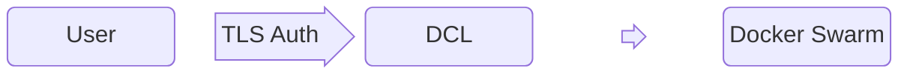

# Introduction

Please complete the [Installation](../setup/installation.md) section that installs DCL. You can install and test
DCL on your laptop ( [minimal](../setup/installation.md#minimal) or [basic](../setup/installation.md#basic) ) or in [AWS cloud](../setup/installation.md#aws-cloud)
The [Installation](../setup/installation.md) page guides you through the setup.

DCL acts as a {==Docker Proxy==}. Hence to talk to DCL, you need Docker CLI tools installed on your system.

??? note "Docker CLI version"

    DCL strongly recommends you to use the latest Docker CLI version (`25.x`), though older Docker CLI versions (from `20.10.x`) should continue to
    work.



## Authentication

You will be talking to DCL using `docker` commands or API. DCL expects a authenticated TLS session between the user (you) and itself. Hence
to talk to DCL, you need certificate and key, placed in `$HOME/.docker` folder.

??? note "Obtain Certificates and Keys"

    The [Installation](../setup/installation.md) page indicates how to get the certificate and key as a end-user to access DCL. Depending on the
    mode ([minimal](../setup/installation.md#minimal),  [basic](../setup/installation.md#basic) or in [AWS cloud](../setup/installation.md#aws-cloud)), it will
    provide you instructions on how to create and get different user certificates and keys.

    The following sections assume that you have obtained the keys and the following files are in place.
    ```
    $HOME/.docker/
      ca.pem
      cert.pem
      key.pem
    ```

    ??? note "If you have the keys in a different folder"

        Ensure you specify the path, where the files `ca.pem`, `cert.pem` and `key.pem` (__with the exact names__) in the environment variable
        `DOCKER_CERT_PATH=/path/where/the/files/reside`

## DCL Host

You need to obtain the info on which host and port, the DCL is accessible. The [Installation](../setup/installation.md) page will guide you
to obtain the IP/Hostname and the port where the DCL is running. You need to set `DOCKER_HOST` environment variable with that info, along
with enabling `DOCKER_TLS_VERIFY=1`

??? note "Setting the Environment Variables"

    You can set the Env variables globally for that shell session, or for each command, or using a bash function.

    === "Once for the session"

        You can set the Env variables for that shell session, like for bash:
        ```bash
        export DOCKER_HOST=tcp://dcl.ip.address:2376/
        export DOCKER_TLS_VERIFY=1
        export DOCKER_CERT_PATH=$HOME/.docker  # Optional, if in $HOME/.docker
        ```

        and then run docker commands as normally as you would do:
        ```bash
        docker ps -a
        docker run ...
        ```

        This is helpful, if you are going to use that shell session only for DCL. If you want to talk to local Docker, please
        dont forget to `unset` the variables.

        ??? warning "Do not put them in ~/.bashrc"

            We dont recommend you set these in your .bashrc, as every docker command you run will be going to DCL and not to your
            local docker. If you prefer, you can put these export commands in a file (such as `~/.dclsource`) and run
            ```bash
            source ~/.dclsource
            ```
            before running any docker command.

    === "For every command"

        You can set the Env variables for each command, like:
        ```bash
        DOCKER_HOST=tcp://dcl.ip.address:2376/ DOCKER_TLS_VERIFY=1 DOCKER_CERT_PATH=$HOME/.docker docker ps -a  # Talks to DCL
        docker ps -a  # Talks to your local Docker
        ```

        You can also put this in your alias in your .bashrc:
        ```
        alias dcldocker="DOCKER_HOST=tcp://dcl.ip.address:2376/ DOCKER_TLS_VERIFY=1"
        dcl docker ps -a # Talks to DCL
        ```

        This method is helpful, if you are mindful of whether you are talking to DCL or local docker.

        In case, if you are a DCL Admin and want to test with different users, you can similary do:
        ```
        alias dcluser="DOCKER_HOST=tcp://dcl.ip.address:2376/ DOCKER_TLS_VERIFY=1 DOCKER_CERT_PATH=$HOME/.keys/user"
        alias dcladmin="DOCKER_HOST=tcp://dcl.ip.address:2376/ DOCKER_TLS_VERIFY=1 DOCKER_CERT_PATH=$HOME/.keys/admin"
        dcluser docker ps -a # Talks to DCL as `user`
        dcladmin docker ps -a # Talks to DCL as `admin`
        ```

## Basic Docker Commands

The following assumes you have set the ENV variables described in the previous section.

??? info "Docker commands run as"
    All examples will show `$ dcladmin docker...` or `$ dcluser docker...` to
    illustrate that this is being run as the corresponding user `admin` or `user`.

    Each command is prefixed by a `$` to specify that this is the command and the
    rest are output

    If you are just setting environment variables using other methods, please
    continue to run them as per your setup.

Now, you can run most docker commands as is.

Listing docker containers.

```console title="docker ps"
$ dcladmin docker ps -a
CONTAINER ID   IMAGE     COMMAND   CREATED   STATUS    PORTS     NAMES
$
```

Running a new container via docker CLI command.

```console title="docker run"
$ dcladmin docker run --name alpine -h alpine -itd alpine sh
w9dujkcmq64i46aqyo7elbnv8

$ dcladmin docker ps -a
CONTAINER ID   IMAGE           COMMAND     CREATED         STATUS         PORTS     NAMES
207b074c8b3a   alpine:latest   "/bin/sh"   9 seconds ago   Up 8 seconds             alpine.1.36vqdaqrncqgp5hb372awhglk
$
```

Exec Into the Container.

```console title="docker exec"
$ dcladmin docker exec -it alpine sh
/ # uname -a
Linux alpine 5.15.0-97-generic #107-Ubuntu SMP Wed Feb 7 13:26:48 UTC 2024 x86_64 Linux
/ # ip addr
1: lo: <LOOPBACK,UP,LOWER_UP> mtu 65536 qdisc noqueue state UNKNOWN qlen 1000
    link/loopback 00:00:00:00:00:00 brd 00:00:00:00:00:00
    inet 127.0.0.1/8 scope host lo
       valid_lft forever preferred_lft forever
39: eth0@if40: <BROADCAST,MULTICAST,UP,LOWER_UP,M-DOWN> mtu 1450 qdisc noqueue state UP
    link/ether 02:42:c0:a8:c8:09 brd ff:ff:ff:ff:ff:ff
    inet 192.168.200.9/24 brd 192.168.200.255 scope global eth0
       valid_lft forever preferred_lft forever
41: eth1@if42: <BROADCAST,MULTICAST,UP,LOWER_UP,M-DOWN> mtu 1500 qdisc noqueue state UP
    link/ether 02:42:ac:12:00:03 brd ff:ff:ff:ff:ff:ff
    inet 172.18.0.3/16 brd 172.18.255.255 scope global eth1
       valid_lft forever preferred_lft forever
/ #
```

Create one more container (nginx).

```console title="docker run"
$ dcladmin docker run --name nginx -h nginx -itd nginx:alpine
fasxkmi8sbf8qs7nfrkgmpc5w

$ dcladmin docker ps -a
CONTAINER ID   IMAGE           COMMAND                  CREATED          STATUS          PORTS     NAMES
b3314f2fdade   nginx:alpine    "/docker-entrypoint.…"   8 seconds ago    Up 6 seconds    80/tcp    nginx.1.07qt6lnyrwthg97p3bebeez0p
207b074c8b3a   alpine:latest   "/bin/sh"                45 seconds ago   Up 43 seconds             alpine.1.36vqdaqrncqgp5hb372awhglk
$ dcladmin docker exec -it nginx sh
/ # uname -a
Linux nginx 5.15.0-97-generic #107-Ubuntu SMP Wed Feb 7 13:26:48 UTC 2024 x86_64 Linux
/ # ip addr | grep "inet "
    inet 127.0.0.1/8 scope host lo
    inet 192.168.200.24/24 brd 192.168.200.255 scope global eth0
    inet 172.18.0.4/16 brd 172.18.255.255 scope global eth1
/ #
```

Communicate between containers.

```console title="docker run"
$ dcladmin docker exec -it alpine sh
/ # wget -O - -q http://nginx
<!DOCTYPE html>
<html>
<head>
<title>Welcome to nginx!</title>
<style>
html { color-scheme: light dark; }
body { width: 35em; margin: 0 auto;
font-family: Tahoma, Verdana, Arial, sans-serif; }
</style>
</head>
<body>
<h1>Welcome to nginx!</h1>
<p>If you see this page, the nginx web server is successfully installed and
working. Further configuration is required.</p>

<p>For online documentation and support please refer to
<a href="http://nginx.org/">nginx.org</a>.<br/>
Commercial support is available at
<a href="http://nginx.com/">nginx.com</a>.</p>

<p><em>Thank you for using nginx.</em></p>
</body>
</html>
```

Delete the containers.
```console title="docker rm"
$ dcladmin docker rm alpine
alpine
$ dcladmin docker rm nginx
nginx
$ dcladmin docker ps -a
CONTAINER ID   IMAGE           COMMAND                  CREATED          STATUS          PORTS     NAMES
b3314f2fdade   nginx:latest    "/docker-entrypoint.…"   4 minutes ago    Up 4 minutes    80/tcp    nginx.1.07qt6lnyrwthg97p3bebeez0p
207b074c8b3a   alpine:latest   "/bin/sh"                5 minutes ago    Up 5 minutes              alpine.1.36vqdaqrncqgp5hb372awhglk

$ sleep 10
$ dcladmin docker ps -a
CONTAINER ID   IMAGE     COMMAND   CREATED   STATUS    PORTS     NAMES
$
```

## What we just accomplished

<div class="grid cards" markdown>

- :fontawesome-brands-docker: Issued regular docker run / ps commands
- :fontawesome-solid-circle-nodes: Containers created in the Swarm Cluster
- :fontawesome-solid-terminal: Able to __exec__ directly to the container (in the cluster)
- :fontawesome-solid-network-wired: Communicate via IP/DNS between containers (in the cluster)
</div>

## For those curious / watchful eyes

!!! info inline "Containers created as Swarm Services"

    Behind the back, DCL transforms your regular docker container requests (`ps`, `run`, `exec`, `rm` etc.) into
    corresponding Docker Swarm Services (equiv of `service create`, `service ls` etc.)

If you had keenly looked at the above output, you would have noticed `docker run` requested
a container name with `alpine`, while there were two discrepencies:

1. output of `docker run` specified an id `w9dujkcmq64i46aqyo7elbnv8` which was not found in subsequent `docker ps`
2. the container name had `alpine.1.36vqdaqrncqgp5hb372awhglk` (not an usual behaviour of `docker run`)

This is because the backend of DCL is a Docker Swarm cluster. The primary purpose of DCL is to be able to use
regular docker containers running anywhere inside a cluster. DCL accomplishes this by transforming the container requests
into a Swarm service. The id you saw was the Docker Swarm Service id, while the container name `alpine.1.36vqdaqrncqgp5hb372awhglk` was the _Task_ name
(or the container name) of the Docker Swarm service.

DCL transparently takes care of the _translating_ the requests from you. In this case, if you ran `docker exec` or `docker inspect` (or similar commands),
you can pass any of the following:

*  container name you requested / swarm service name (in this example: `alpine`)
*  container id you see in `docker ps -a` output (in this case: `207b074c8b3a`)
*  swarm task name / resulting container name (in this example, `alpine.1.36vqdaqrncqgp5hb372awhglk`)
*  swarm service id (in this example, `w9dujkcmq64i46aqyo7elbnv8`)

??? info "More examples to showcase"

    <div class="annotate" markdown>
    Create the container and show output from container as well as the service details (for the same container)
    ``` { .console .annotate }
    $ dcladmin docker run --name mycont -h mycont -itd alpine sh -c "while true; do date; echo In_the_Loop; sleep 5; done"
    2rg3gji4esa03ltwdyee0cz0o (1)
    $ dcladmin docker ps -a
    CONTAINER ID     IMAGE           COMMAND                  CREATED         STATUS         PORTS     NAMES
    9fb18ab2e064(2)  alpine:latest   "sh -c 'while true; …"   7 seconds ago   Up 5 seconds             mycont.1.l6a5cxnguhdgwwgw3cwykcvjf (3)
    $ dcladmin docker service ls
    ID                NAME      MODE         REPLICAS   IMAGE     PORTS
    2rg3gji4esa0(4)   mycont    replicated   1/1        alpine
    $ dcladmin docker service ps mycont
    ID              NAME       IMAGE     NODE      DESIRED STATE   CURRENT STATE            ERROR     PORTS
    l6a5cxnguhdg(5) mycont.1   alpine    swarm2(6) Running         Running 13 seconds ago
    ```

    </div>

    1.   service Id
    2.   container Id
    3.   task name / container name
    4.   service Id (same as before)
    5.   task Id
    6.   node name

    <div class="annotate" markdown>
    Now do multiple container operations (exec, inspect, logs, top) using (container/service name, service id, container id, task name)
    ``` { .console .annotate }
    $ dcladmin docker exec -it mycont ls /
    (1)
    bin    etc    lib    mnt    proc   run    srv    tmp    var
    dev    home   media  opt    root   sbin   sys    usr
    $ dcladmin docker inspect 2rg3gji4esa03ltwdyee0cz0o | grep -E "com.docker.swarm|IPv4Address"
    (2)
                    "com.docker.swarm.node.id": "h4de846tqqkahigkbet9ln6wq",
                    "com.docker.swarm.service.id": "2rg3gji4esa03ltwdyee0cz0o",
                    "com.docker.swarm.service.name": "mycont",
                    "com.docker.swarm.task": "",
                    "com.docker.swarm.task.id": "l6a5cxnguhdgwwgw3cwykcvjf",
                    "com.docker.swarm.task.name": "mycont.1.l6a5cxnguhdgwwgw3cwykcvjf",
                            "IPv4Address": "192.168.200.42"
    $ dcladmin docker logs 9fb18ab2e064 | tail -3
    (3)
    In_the_Loop
    Sun May  5 06:26:26 UTC 2024
    In_the_Loop
    $ dcladmin docker top mycont.1.l6a5cxnguhdgwwgw3cwykcvjf
    (4)
    PID                 USER                TIME                COMMAND
    67071               root                0:00                sh -c while true; do date; echo In_the_Loop; sleep 5; done
    67375               root                0:00                sleep 5
    ```

    </div>

    1.   `mycont` - container name requested (same as service name)
    2.   `2rg3gji4esa03ltwdyee0cz0o` - service id
    3.   `9fb18ab2e064` - container id
    4.   `mycont.1.l6a5cxnguhdgwwgw3cwykcvjf` - task name / resulting container name

## Next Steps

<div class="grid cards" markdown>

- :fontawesome-brands-docker: All about Creating regular [containers](containers.md) in the cluster
- :fontawesome-brands-docker: Creating docker [service](services.md) (swarm) in the cluster
- :fontawesome-solid-warehouse: Support for different types of [volumes](volumes.md)
- :fontawesome-solid-arrow-right-to-bracket: [Ingress](ingress.md) - Connecting to services from outside the cluster
- :fontawesome-regular-clone: Creating [Replicas](replicas.md) and High Availability
- :fontawesome-solid-gears: [Configs and Secrets](configs.md)
- :fontawesome-solid-layer-group: [Global services](global-services.md) aka daemonsets
- :fontawesome-solid-memory: [Resources](resources.md) - CPU / Memory / Diskspace Mgmt

</div>
