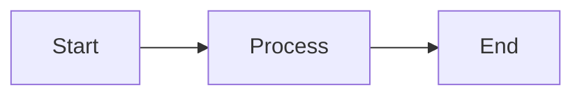
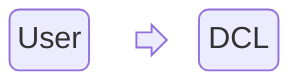

# Testing

For full documentation visit [mkdocs.org](https://www.mkdocs.org).

## Commands

* `mkdocs new [dir-name]` - Create a new project.
* `mkdocs serve` - Start the live-reloading docs server.
* `mkdocs build` - Build the documentation site.
* `mkdocs -h` - Print help message and exit.

## Project layout

    mkdocs.yml    # The configuration file.
    docs/
        index.md  # The documentation homepage.
        ...       # Other markdown pages, images and other files.

## Unordered list

- This is the start of the unordered list
    - second level
        - third level first
        - third level second
    - second level next item
    - second level last item
  
## Ordered list

1. This is the start of the unordered list
    1. second level
        - third level first
        - third level second
    1. second level next item
    1. second level last item

## Definition Lists

`def 1`

:  This is a great definion one
  
`def 2`

:  This is a great definion two

## Task lists

- [x] First task
- [ ] Second task header, not checked
    * [x] sub task 2.1 checked
    * [ ] sub task 2.2 not checked
- [ ] Third task, not checked

## Admonition

!!! note

    This is a great note, spanning two to three lines.
    This is a great note, spanning two to three lines.
    This is a great note, spanning two to three lines.
  
!!! note "Note with a Header"

    This is a great note, spanning two to three lines.
    This is a great note, spanning two to three lines.
    This is a great note, spanning two to three lines.
  
!!! note ""

    Note without any title
    This is a great note, spanning two to three lines.
    This is a great note, spanning two to three lines.
  
??? note "Collapsible Note"

    This is a great note, spanning two to three lines.
    This is a great note, spanning two to three lines.


!!! info inline end "Inline at the end"
    
    This is a great note, spanning two to three lines.
    This is a great note, spanning two to three lines.

This is a great note, spanning two to three lines.
This is a great note, spanning two to three lines.
This is a great note, spanning two to three lines.
This is a great note, spanning two to three lines.

This is a great note, spanning two to three lines.
This is a great note, spanning two to three lines.
This is a great note, spanning two to three lines.
This is a great note, spanning two to three lines.

## Emojis

This is my smile :smile: boss and this A/B Testing :material-access-point-off:

## Content tabs

=== "Tab 1"

    This is a great note, spanning two to three lines.
    This is a great note, spanning two to three lines.

=== "Tab 2"

    This is a great note, spanning two to three lines.
    This is a great note, spanning two to three lines.

    I want to add annotation to this topic (1), which continues talking about it
    { .annotate }

    1.  :man_raising_hand: This is an annotation to explain this `topic`.

## Annonation

I want to add annotation to this topic (1), which continues talking about it
{ .annotate }

1.  :man_raising_hand: This is an annotation to explain this `topic`.

I want to add nested annotation to this topic (1), which continues talking about it
{ .annotate }

1.  :man_raising_hand: This is an annotation to explain this `topic`. Further (1)
    { .annotate }

    1. :woman_raising_hand: This is the next level annotation


## Code blocks

First block of code

``` { .yaml .select }
site_name: DCL Doc
theme:
  icon:
    logo: material/library
  name: material
```

Second block of code with annotation

``` { .yaml .annotate }
site_name: DCL Doc
theme:
  icon:
    logo: material/library
  name: material # (1)!
```

1. :man_raising_hand: This is an annotation to explain this `topic`.


Third block with header

``` { .yaml .copy title="Third block with header" linenums="1" hl_lines="1 1" }
site_name: DCL Doc
theme:
  icon:
    logo: material/library
  name: material
```

The `range()` cooe is to highight that line

## Footnotes

Lorem ipsum[^1] dolor sit amet, consectetur adipiscing elit.[^2]

[^1]: This is the footnote 1
[^2]: 
    This is the footnote 2, which is multiline and you can go on
    and on and on

## Formatting


Text can be {--deleted--} and replacement text {++added++}. This can also be
combined into {~~one~>a single~~} operation. {==Highlighting==} is also
possible {>>and comments can be added inline<<}.

{==

Formatting can also be applied to blocks by putting the opening and closing
tags on separate lines and adding new lines between the tags and the content.

==}

## Card Grid


<div class="grid cards" markdown>

- :fontawesome-brands-html5: __HTML__ for content and structure
- :fontawesome-brands-js: __Javascript__ for dynamism
- :fontawesome-brands-css3: __CSS__ for text running out of boxes
- :fontawesome-brands-internet-explorer: __IE__ aargh..
</div>

## Tables

=== "Std"

    | Method    |    Description                 |
    |---------- | ------------------------------ |
    | `#!yaml GET`     | :material-check:  Fetch resource |
    | `#!yaml PUT`     | :material-check-all:  Update resource |
    | `#!yaml DELETE`     | :material-close:  Delete resource |

=== "Left"

    | Method    |    Description                 |
    | :-------- |  :---------------------------- |
    | `GET`     | :material-check:  Fetch resource |
    | `PUT`     | :material-check-all:  Update resource |
    | `DELETE`     | :material-close:  Delete resource |

=== "Center"

    | Method    |    Description                 |
    | :-------: |  :---------------------------: |
    | `GET`     | :material-check:  Fetch resource |
    | `PUT`     | :material-check-all:  Update resource |
    | `DELETE`     | :material-close:  Delete resource |

=== "Right"

    | Method    |    Description                 |
    | --------: |  ----------------------------: |
    | `GET`     | :material-check:  Fetch resource |
    | `PUT`     | :material-check-all:  Update resource |
    | `DELETE`     | :material-close:  Delete resource |

## Flow chart



## Block diagrams



## Testing

Create the container and show output from container as well as the service details (for the same container)


??? info "....Continued"

    <div class="annotate" markdown>
    Now do multiple container operations (exec, inspect, logs, top) using (container/service name, service id, container id, task name)
    ``` { .console .annotate }
    $ dcladmin docker exec -it mycont (1)
    $ dcladmin docker run --name mycont -h mycont -itd alpine sh -c "while true; do date; echo In_the_Loop; sleep 5; done" (1)
    2rg3gji4esa03ltwdyee0cz0o (1)
    ```

    </div>

    1.   container name requested (same as service name)


??? info "More examples to showcase"

    <div class="annotate" markdown>
    Create the container and show output from container as well as the service details (for the same container)
    ``` { .console .annotate }
    $ dcladmin docker run --name mycont -h mycont -itd alpine sh -c "while true; do date; echo In_the_Loop; sleep 5; done"
    2rg3gji4esa03ltwdyee0cz0o (1)
    $ dcladmin docker ps -a
    CONTAINER ID     IMAGE           COMMAND                  CREATED         STATUS         PORTS     NAMES
    9fb18ab2e064(2)  alpine:latest   "sh -c 'while true; …"   7 seconds ago   Up 5 seconds             mycont.1.l6a5cxnguhdgwwgw3cwykcvjf (3)
    $ dcladmin docker service ls
    ID                NAME      MODE         REPLICAS   IMAGE     PORTS
    2rg3gji4esa0(4)   mycont    replicated   1/1        alpine
    $ dcladmin docker service ps mycont
    ID              NAME       IMAGE     NODE      DESIRED STATE   CURRENT STATE            ERROR     PORTS
    l6a5cxnguhdg(5) mycont.1   alpine    swarm2(6) Running         Running 13 seconds ago
    ```

    </div>

    1. Service Id
    2. Container Id
    3. Task name
    4. Service Id (same as before)
    5. Task Id
    6. Node name

